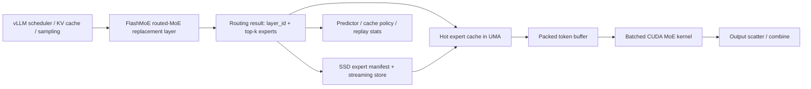

# FlashMoE GB10 Current Status

## Objective

Target: run `Qwen3.5-397B` class MoE models on a single `DGX Spark GB10` with `128 GB` unified memory.

Current source checkpoint fact:

- the downloaded `Qwen3.5-397B-A17B` checkpoint is already an `FP8` model variant
- earlier expert replay used a `bf16` export path for compatibility, which inflated expert file size relative to the source checkpoint
- this was not a source-model change to `FP16`
- the current exporter default is `EXPORT_DTYPE=bf16`, not `fp16`

Precision relationship for the current pipeline:

1. source checkpoint on disk: `FP8`
2. first compatibility export path during expert splitting: `bf16`
3. current compact export path: `Q3-like packed`

So if any earlier comparison or oral summary mentioned `FP16`, that was inaccurate shorthand.
The actual implemented path has been:

- `FP8 source checkpoint`
- `bf16 intermediate expert export`
- then `Q3-like packed expert export`

The engineering premise is:

- `vLLM resident path` is the best baseline when all routed experts can stay resident.
- `FlashMoE path` becomes necessary when routed experts no longer fit in UMA and must be streamed from SSD with an explicit hot cache.

## Current architecture

Implemented modules:

- `python/flashmoe_vllm_plugin/vllm_adapter.py`
  - vLLM model wrapper and routed layer replacement scaffold
- `python/csrc/flashmoe_ops.cpp`
- `python/csrc/flashmoe_ops_cuda.cu`
  - custom CUDA routed-expert path
- `python/flashmoe_vllm_plugin/streaming.py`
  - SSD-backed expert manifest, explicit cache budget, replay stats
- `python/flashmoe_vllm_plugin/q3like.py`
  - `Q3-like` packed expert storage format with per-row scale and 3-bit packed weights
- `python/flashmoe_vllm_plugin/train_predictor.py`
- `python/flashmoe_vllm_plugin/build_cache_dataset.py`
- `python/flashmoe_vllm_plugin/train_policy.py`
  - predictor and cache-policy training chain
- `include/flashmoe/model_spec.h`
- `include/flashmoe/runtime_plan.h`
- `include/flashmoe/online_runtime.h`
- `include/flashmoe/decode_harness.h`
- `include/flashmoe/streamed_runtime.h`
  - dedicated C++ runtime planning, control-plane, decode harness, and streamed-runtime entrypoint

## Technical point status

The current project now contains three kinds of technical items:

1. fully implemented and validated
2. partially implemented or only validated at the control-plane level
3. not yet implemented, but identified as a next-step optimization

### Status matrix

| Technical point | Current status | Current implementation | What is still missing |
|---|---|---|---|
| Layer-major scheduling | partial | layer-major packed token buffer in the CUDA routed-expert path; runtime plan requires `use_layer_major_bundle_layout=true`; manifest/store are organized around `layer_id + expert_id` | true layer-major SSD bundle files, persistent per-layer compute-ready slots, and a fully fused cross-layer runtime scheduler |
| Dan Woods style sparse activation | partial in spirit, not full implementation | only top-k routed experts are touched; active experts are promoted into slots on demand; runtime never assumes dense activation of all experts | no dedicated sparse-activation data structure or end-to-end sparse activation engine in the Dan Woods / ds4 sense; current compute still rebuilds active expert work from routing events |
| Manual low-bit quantization `IQ3_XXS` | not implemented | none | no exporter, no manifest format, no unpack path, no runtime support |
| Manual low-bit quantization `IQ4_XS` | not implemented | none | no exporter, no manifest format, no unpack path, no runtime support |
| Manual low-bit quantization `Q3-like` | implemented | `q3like.py`, `export_qwen_experts.py`, replay support, runtime manifest/store support, GPU-unpack mainline planning | still unpacks to dense before current compute path; not a native packed compute kernel |
| DRAM sparse cache / hot expert cache | implemented | explicit expert cache budget, slot cache, hit/miss/eviction accounting, streamed runtime budget output | budget is explicit, but true KV/workspace/runtime enforcement is still becoming runtime-hard, not only reported |
| GPU-side unpack mainline | partial | `gpu_unpack` device profile, integrated into decode harness and streamed runtime reporting | not yet a fully measured device-resident unpack-to-slot kernel inside the final decode loop |
| Measured compute-profile injection | implemented | CUDA benchmark emits `compute_profile.json`; streamed runtime can consume it | measured profile still comes from the current custom op, which mixes pure compute with some dispatch overhead |
| Dedicated streamed runtime executable | partial | `flashmoe_streamed_runtime` integrates plan + manifest + trace + slot cache + decode-stage timing | it is still a runtime-stage execution skeleton, not yet the full end-to-end serving engine |

## What has been implemented

### 1. vLLM integration control plane

- Out-of-tree plugin registration
- model wrapper for `Qwen3` MoE style architectures
- feature flags for:
  - expert streaming
  - DRAM sparse cache
  - predictor
  - cache policy
  - chunked `pread`
  - shared expert overlap

### 2. CUDA routed-expert data path

Current routed-expert kernel path:

1. flatten `top-k` routes
2. sort by expert id
3. build a layer-major packed token buffer
4. run gate / up / down expert MLPs on packed buffers
5. apply router weights
6. scatter results back to token order

Important implementation changes already completed:

- first working CUDA custom op
- packed routed-token buffer
- grouped-by-count batched GEMM
- fewer temporary tensor allocations
- fewer descriptor / launch rebuilds than the first version

What was wrong in the first implementation:

- per-expert execution shape
- fragmented gather/scatter in the hot path
- repeated small temporary allocations
- repeated descriptor rebuilds

Observed effect:

- functionally correct
- worst performance among the three paths

### 3. 397B-oriented streaming control plane

Implemented for the real single-node `397B` problem:

- explicit expert cache budget in GB
- expert manifest builder from packed expert files
- resumable routed-expert exporter
- `Q3-like packed` expert export option for much smaller SSD payloads
- SSD read path with chunked `pread`
- streaming replay with:
  - cache hit / miss
  - read bytes
  - read ops
  - evictions
  - peak resident bytes
- synthetic trace generation when real routing trace is not yet available
- runtime routing-trace writer inside the replaced MoE layer

This is the first step needed to answer:

- how much expert traffic must spill to SSD
- whether `96 GB` hot cache is enough
- whether hit rate is high enough to keep single-node latency practical

### 4. Q3-like packed expert format

Current `Q3-like` implementation compresses only the routed expert MLP weights:

- `gate_proj.weight`
- `up_proj.weight`
- `down_proj.weight`

It does not compress:

- activations
- router logits / route ids
- shared experts
- attention or KV cache
- dense non-expert layers

Storage layout per tensor:

- `*.qweight`: 3-bit packed integer stream
- `*.scale`: per-row scale tensor
- `*.shape`: original matrix shape

Current semantics:

- this is a storage and SSD-transport format first
- weights are unpacked back to dense tensors before the current CUDA expert kernel consumes them

So in engineering terms:

- `quantization` is the broad family of reduced-precision representations and optionally reduced-precision compute
- current `Q3-like` is a quantized storage format, but not yet a true end-to-end quantized compute kernel
- the immediate benefit today is much lower expert file size and much lower SSD traffic
- the next benefit later would come from native packed-kernel execution without dense unpack

### 5. Dedicated online runtime path

After the `vLLM + PyTorch wrapper` path was validated as non-deployable, implementation moved to a dedicated C++ runtime path in stages:

1. `model_spec` and `runtime_plan`
   - abstracted `Qwen3.5-397B-A17B` and `DeepSeek-V4-Flash`
   - avoided hard-coding the runtime around only one MoE family
2. `online_runtime_demo`
   - validated that manifest + trace can drive a routed-expert control plane outside the framework parameter tree
3. `decode_harness`
   - added route/load/unpack/compute/combine timing breakdown
   - added `host_unpack` and `gpu_unpack` profiles
4. measured compute-profile injection
   - replaced optimistic constant `compute_ms` with a profile generated from the real CUDA custom op
5. `flashmoe_streamed_runtime`
   - merged control-plane and decode-stage timing into one runtime executable instead of keeping them as separate demos only
6. `streamed_engine / streamed_session / streamed_service`
   - added a narrow-engine style end-to-end deployment scaffold
   - runtime state now survives across generated tokens inside a session
   - added a thin HTTP service shell around the streamed runtime core
7. `kv_cache + dense decode chain`
   - added explicit `KV cache` session state with budget tracking
   - added a minimal dense-resident decode path:
     - embedding
     - attention
     - norm/router
     - lm head
   - integrated these phases into the session token loop
   - prompt creation and later user turns now also run through a minimal prefill path instead of only updating counters
   - the thin service layer now returns request-level timing breakdown for dense and expert phases so new bottlenecks can be attributed to a specific stage
8. `decode state + token sampling chain`
   - added a unified session decode state that is updated by both prefill and decode steps
   - token generation no longer depends only on `prompt + trace cursor`; it now flows through a minimal `decode_state -> sample_next_token` chain
   - the service now returns sampled `token_ids` together with generated text
9. `runtime_router` fallback
   - the narrow engine can now generate per-layer routed expert selections internally when no external trace is supplied
   - this removes the hard dependency on `routing_trace.txt` for end-to-end service validation
   - router decisions now consume a minimal dense hidden-state chain instead of being generated from decode-state hashes alone
10. `switchable expert execution backend`
   - added a CPU reference backend for materialize/unpack/execute/combine inside the service main path
   - added a CUDA expert backend build path so GB10 can move `unpack + expert compute` onto device when CUDA toolkit is present

## Resident benchmark status

Current microbenchmark result:

| tokens | torch | vLLM | flashmoe |
|---|---:|---:|---:|
| 1 | 0.776 | 10.400 | 0.768 |
| 8 | 6.177 | 12.820 | 6.108 |
| 16 | 12.359 | 14.255 | 12.274 |
| 32 | 24.512 | 15.916 | 18.826 |
| 64 | 49.181 | 16.813 | 25.187 |

Interpretation:

- `flashmoe` is no longer the worst path.
- it now matches `torch` at small and medium token counts and beats it at `32/64`.
- it is still behind stock `vLLM fused_experts` in the resident-only case.

This resident benchmark is useful only for one question:

- whether the CUDA routed-expert kernel shape is improving

It is not the final decision metric for the `397B on 128 GB UMA` problem, because:

- all experts are still resident in this benchmark
- SSD streaming is not active here
- FlashMoE's main system-level advantage only appears once routed experts stop fitting in memory

## Streaming validation status

### Replay stage

Dense expert replay on the same synthetic trace:

- `hit_rate=0.863`
- `bytes_read_gb=211.723`
- `evictions=4318`

`Q3-like` replay on the same synthetic trace:

- `hit_rate=0.869`
- `bytes_read_gb=38.147`
- `evictions=0`

Result:

- routed-expert SSD traffic dropped by about `82%`
- the main bottleneck moved from expert file size to online unpack + compute

### Online runtime control-plane stage

Real manifest + real routing trace with `4096` route steps:

- `manifest_entries=30720`
- `unique_experts_seen=2584`
- `dense_resident_gb=10.640`
- `hot_cache_used_gb=12.227`
- `cache_evictions=0`

Result:

- routed-expert working set is much smaller than the full expert corpus
- `96 GB` hot cache was validated as oversized for the observed trace
- the current bottleneck is not cache capacity

### Decode harness stage

Estimated decode-stage breakdown before measured compute injection:

- `gpu_unpack avg_total_ms=0.579`
- this looked consistent with a possible `20-30 tok/s` class runtime budget

Problem found:

- the estimate used optimistic constant `compute_ms`
- it was useful for direction finding, but too optimistic for deployment conclusions

### Measured compute-profile stage

After generating a compute profile from the real CUDA custom op and injecting it into the runtime harness:

- `host_unpack avg_compute_ms=1.039`
- `gpu_unpack avg_compute_ms=1.039`
- `host_unpack avg_total_ms=1.440`
- `gpu_unpack avg_total_ms=1.362`
- `host_unpack warm_avg_total_ms=1.102`
- `gpu_unpack warm_avg_total_ms=1.096`

Result:

- `gpu_unpack` is still the correct mainline path
- but the dominant bottleneck is now clearly the compute/dispatch path, not SSD or cache size
- the earlier optimistic budget must be revised downward until pure compute is isolated further

### Current runtime executable

The repository now contains `flashmoe_streamed_runtime`, which:

- reads real `expert_manifest.json`
- reads real routing trace
- applies the dedicated runtime plan
- uses the compute-ready slot cache
- optionally injects a measured CUDA compute profile
- emits integrated runtime-stage statistics rather than only standalone benchmark numbers

The repository now also contains `flashmoe_streamed_service`, which:

- adds `engine / session / service` layering inspired by the narrow-engine direction
- exposes:
  - `GET /healthz`
  - `GET /v1/models`
  - `POST /v1/sessions`
  - `GET /v1/sessions/<id>`
  - `POST /v1/chat/completions`
- supports:
  - persistent streamed sessions
  - `session_id` reuse
  - `stream=true` SSE responses
- keeps routed-expert slot-cache behavior inside the request/session lifecycle
- acts as the first deployment shell around the streamed runtime

The session runtime now also tracks:

- `KV cache` budget and used bytes
- dense decode phase timing
- finish reason when decode must stop because the `KV cache` budget is exhausted

## Why `torch`, `vLLM`, and `flashmoe` behave differently

### `torch` path

Path shape:

- eager Python loop
- direct matmul-based expert execution
- no global route packing
- no fused MoE dispatch

Why it behaves this way:

- very low fixed scheduling overhead
- simple and mature matmul kernels
- cost grows almost linearly with tokens because there is little dispatch amortization

Best at:

- tiny resident workloads
- quick sanity baseline

### `vLLM` path

Path shape:

- stock `fused_experts(...)`
- mature GPU-side MoE dispatch
- packed expert scheduling
- more fused execution structure than plain eager matmul

Why it behaves this way:

- higher fixed cost at very small token counts
- much lower incremental cost as tokens grow
- dispatch and compute are already organized in a production-style fused path

Best at:

- resident expert execution
- serving-oriented throughput path

Current caveat:

- current tests still use default GB10 MoE config, not a final device-tuned config

### `flashmoe` path

Path shape:

- vLLM wrapper + custom routed-MoE op
- route flatten + sort
- layer-major packed token buffer
- batched expert GEMM on packed buffers
- scatter back to original token order

Why it still trails `vLLM`:

- route sort and bucket construction still cost time
- host-side batched pointer preparation still exists
- activation and output combine are not fully fused
- current microbenchmark still keeps all experts resident, so FlashMoE's main SSD-streaming advantage is not yet activated

Best at:

- the transition point where resident execution stops fitting
- future SSD-streamed expert execution with explicit cache control

## Current conclusion

What has been validated:

- export / manifest / replay toolchain works
- `Q3-like` is effective at reducing cold expert traffic
- the dedicated routed-expert control plane works outside the framework parameter tree
- a single-node GB10 runtime can keep the observed routed-expert working set within a small hot cache footprint
- `gpu_unpack` is better than `host_unpack`

What is not yet solved:

- the true grouped compute / dispatch path is still too expensive once measured from the existing CUDA op
- therefore the current runtime path is not yet ready to claim final `20-30 tok/s` delivery
- `Layer-major scheduling` is present only as packed-buffer and planning logic, not yet as a fully bundled SSD-to-slot runtime
- Dan Woods style sparse activation is only approximated by top-k active expert promotion, not implemented as a dedicated sparse-activation engine
- `IQ3_XXS` and `IQ4_XS` are not implemented; the only manual low-bit expert format currently in the repo is `Q3-like`
- the new service layer is a deployment scaffold, not yet a full attention/KV/logits inference stack
- the new decode loop now includes a minimal `KV cache + dense decode chain`, but still does not execute the final real model attention/logits kernels

What changed in the engineering plan:

1. first step: validate wrapper path
   - result: not deployable
2. second step: validate export / replay / cache sizing
   - result: feasible
3. third step: validate dedicated runtime control plane
   - result: feasible
4. fourth step: inject measured compute
   - result: main bottleneck moved to compute/dispatch
5. next step:
   - land the runtime as a single executable path
   - shrink default hot-cache budget to `24 GB` and make `KV / workspace / safety` explicit in the runtime plan
   - then continue reducing compute/dispatch cost inside that runtime rather than in isolated microbenchmarks

## FlashMoE version evolution

### First working version

What it implemented:

- custom CUDA MoE op could run end-to-end
- per-expert forward path with `cuBLASLt`
- route handling worked functionally

Why it was the worst performer:

- one expert at a time
- repeated `index_select` and `index_add_` in the hot loop
- repeated temporary allocations for `gate / up / act / down`
- repeated descriptor and launch overhead
- too much control-path overhead relative to compute

This is why earlier results looked like:

- `8 tokens`: `19.485 ms`
- `16 tokens`: `43.338 ms`
- `32 tokens`: `84.291 ms`
- `64 tokens`: `138.576 ms`

### Intermediate packed-buffer version

What changed:

- moved from per-expert gather/scatter to one global pack and one global scatter
- removed the worst repeated token movement overhead

Effect:

- improved structural efficiency
- but still not enough because expert execution was still too fragmented

### Current batched-GEMM version

What changed:

- preserved the layer-major packed buffer
- changed expert execution from per-expert GEMM to grouped-by-count batched GEMM
- reduced temporary allocation churn
- reduced descriptor / launch rebuild overhead

Effect:

- `flashmoe` moved from worst to middle
- token scaling slope improved materially
- resident-path benchmark is now credible enough to validate kernel-shape improvements

## Functional evolution summary

Stage 1: baseline plumbing

- vLLM plugin scaffold
- custom CUDA extension build path
- benchmark scripts
- initial routed-MoE replacement

Result:

- pipeline could run
- but no meaningful deployment signal yet

Stage 2: first resident CUDA path

- per-expert `cuBLASLt` forward
- basic route handling

Result:

- functional correctness
- very poor scaling
- `flashmoe` became the slowest path

Stage 3: resident kernel restructuring

- layer-major packed token buffer
- grouped-by-count batched GEMM
- less allocator and descriptor churn

Result:

- `flashmoe` moved from worst to middle
- became competitive with `torch`
- still behind resident `vLLM`

Stage 4: expert export and replay control plane

- resumable expert export
- expert manifest
- synthetic trace
- replay statistics
- explicit hot cache budget

Result:

- system-level FlashMoE questions became measurable
- initial dense replay proved the cache logic worked
- but SSD traffic was still too high

Stage 5: Q3-like packed experts

- packed 3-bit storage for routed expert weights
- same replay path reused for apples-to-apples comparison

Result:

- SSD traffic dropped from `211.723 GB` to `38.147 GB`
- `evictions` dropped from `4318` to `0`
- active working set fit inside the configured hot cache

Stage 6: minimum online streaming deployment path

- replaced MoE layer can now:
  - route
  - load only active experts from manifest/cache
  - decode `Q3-like` experts
  - remap expert ids locally
  - run the existing CUDA kernel on the active packed set

Result:

- project has moved beyond replay-only validation
- first real online deployment path now exists
- but it is still not the final performance form

Stage 7: online deployment validation failure

What was attempted:

- boot `vLLM` with the FlashMoE wrapper
- inherit model-native `FP8` quantization
- replace routed MoE layers with streaming-backed execution
- skip routed expert weight loading during `load_weights`

Observed result:

- startup progressed through multiple compatibility fixes
- online inference remained extremely slow
- one run stalled for roughly an hour during inference
- final failure still occurred with CUDA / UMA out-of-memory
- PyTorch resident usage still reached about `112 GiB`

Conclusion from this stage:

- the current `vLLM + PyTorch wrapper` online path is not deployable for the target `397B on 128 GB UMA` objective
- the remaining blocker is architectural, not a single missing kernel optimization

## Current conclusion

The current result does not yet prove that FlashMoE beats resident `vLLM`.

It proves two narrower but important things:

1. the CUDA implementation has moved from an inefficient prototype to a structurally reasonable packed MoE path
2. the project is now ready to shift focus from resident microbenchmarks to the real `397B` question:
   can SSD-streamed experts plus explicit hot cache keep single-node latency within range on `128 GB` UMA

What has now been disproved:

- simply wrapping `vLLM` with a FlashMoE layer replacement is not enough to obtain a deployable streamed-397B runtime on GB10

## Streaming replay status

First replay result on the exported expert corpus:

- `manifest_entries=30720`
- `requests=61440`
- `hit_rate=0.863`
- `miss_rate=0.137`
- `bytes_read_gb=211.723`
- `effective_read_gbps=0.887`
- `evictions=4318`
- `peak_resident_gb=103.055`

After switching routed experts to `Q3-like packed` export:

- `manifest_entries=30720`
- `requests=61440`
- `hit_rate=0.869`
- `miss_rate=0.131`
- `bytes_read_gb=38.147`
- `effective_read_gbps=0.939`
- `evictions=0`
- `peak_resident_gb=38.147`

Meaning:

- expert traffic to SSD dropped by about `82%`
- the active expert working set for the synthetic trace now fits comfortably inside the configured hot cache
- the project has moved from replay-only feasibility to a minimum online deployment path

## Online deployment status

Current online path now supports:

1. route in the replaced vLLM MoE layer
2. look up active experts from the manifest
3. read expert files through the explicit streaming cache on misses
4. decode `Q3-like` expert tensors back to dense expert weights
5. stack only active experts for the current layer
6. remap global expert ids to local packed expert ids
7. execute the existing CUDA routed-expert kernel on the active packed set

This path has been validated as functionally meaningful but operationally not viable for the target deployment.

Remaining main gaps:

- unpack still happens on the host side before CUDA execution
- active expert tensors are restacked every step
- no native `Q3-like` CUDA kernel yet
- no predictor-driven online prefetch yet
- the base `vLLM / PyTorch` model stack still retains too much resident structure and runtime overhead
- routed experts are not fully removed from the model-object / framework lifecycle

Latest online validation outcome:

- online startup can get through model-selection and quantization compatibility fixes
- actual inference can become extremely slow
- UMA usage can still rise to roughly `112 GiB`
- deployment can still end in CUDA out-of-memory

Why this online path is not currently feasible:

1. it is still fundamentally a `vLLM + PyTorch` execution stack
2. the FlashMoE logic is injected only around routed MoE execution, not as a fully independent streamed runtime
3. `Q3-like` currently reduces SSD traffic, but compute still expands back to dense tensors before expert GEMM
4. active expert tensors are rebuilt every step, which adds large host-side and allocator overhead
5. the framework still keeps too much model structure resident for the target memory budget

Therefore the project currently supports:

- offline sizing and replay validation
- expert export and compression
- cache / I/O / working-set analysis

But it does not yet support:

- practical end-to-end online deployment of `Qwen3.5-397B` on GB10 through the present `vLLM wrapper` path

Interpretation:

- the end-to-end export -> manifest -> synthetic trace -> replay chain is working
- a `96 GiB` hot cache is large enough to keep hit rate around `86%` on the current synthetic trace
- `Q3-like` materially reduces expert traffic and proves the storage / bandwidth direction is correct
- however, the current online runtime integration remains not deployable
- the dominant online blocker is now runtime architecture, not just expert file size

Immediate engineering response:

- stop treating the current `vLLM wrapper` path as the main deployment target
- keep the current project as:
  - preprocessing
  - replay
  - cache-policy / predictor tooling
  - expert compression and manifest tooling
- move the next online implementation toward a dedicated streamed-MoE runtime

## Next step for real 397B landing

1. Keep using the current repo for:
   - expert export
   - `Q3-like` compression
   - manifest generation
   - routing replay
   - cache budget sweep
2. Collect real routing traces and size the hot cache budget using the replay pipeline.
3. Move online deployment work to a dedicated runtime that:
   - does not instantiate full routed expert modules inside `vLLM / PyTorch`
   - keeps routed experts outside the framework parameter tree
   - performs GPU-side unpack or native packed expert compute
   - overlaps I/O, decode scheduling, and expert execution explicitly
4. Treat the current online wrapper path as a prototype only, not as the final deployment candidate.
